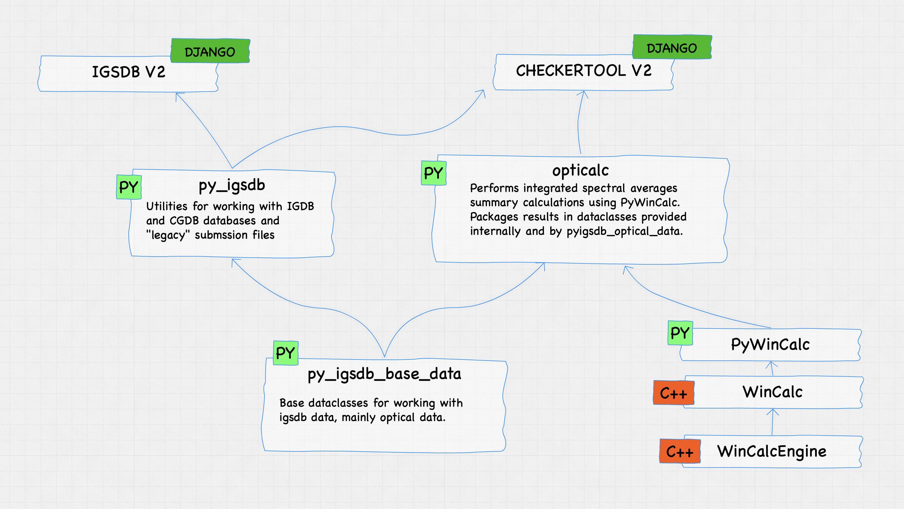

# py_igsdb_base_data

This library contains dataclasses to assist with Checkertool and IGSDB-related data and operations.

Its main purpose is to allow Python applications to correctly structure IGSDB integrated
summary values optical data as generated by WinCalcEngine via PyWinCalc. These dataclasses were
pulled out of PyWinCalc into this library to provide access to them without requiring
installation of the very large PyWinCalc library.

This library also contains some base dataclasses used by applications like Checkertool V2 and IGSDB V2
and libraries like py_igsdb and opticalc.




# License

Berkeley Lab WINDOW Calc Engine (CalcEngine) Copyright (c) 2016 - 2020, The Regents of the University of California,
through Lawrence Berkeley National Laboratory (subject to receipt of any required approvals from the U.S. Dept. of
Energy). All rights reserved.

If you have questions about your rights to use or distribute this software, please contact Berkeley Lab's Innovation &
Partnerships Office at IPO@lbl.gov.

NOTICE. This Software was developed under funding from the U.S. Department of Energy and the U.S. Government
consequently retains certain rights. As such, the U.S. Government has been granted for itself and others acting on its
behalf a paid-up, nonexclusive, irrevocable, worldwide license in the Software to reproduce, distribute copies to the
public, prepare derivative works, and perform publicly and display publicly, and to permit other to do so.

## Install

Create a virtualenv set to use Python3:

`mkvirtualenv --python=(path to python3) py_igsdb_data_data`

On MacOS this might look like:

`mkvirtualenv --python=/usr/local/bin/python3 py_igsdb_data_data`

Pip install this library:

` pip install git+https://github.com/LBNL-ETA/py_igsdb_data_data.git `

You now have access to the IGSDB-focused classes in this library:

```shell
> python
Type "help", "copyright", "credits" or "license" for more information.
>>> from py_igsdb_optical_data.optical import AngularResolutionType
>>> a = AngularResolutionType.DIRECT
>>> a
<AngularResolutionType.DIRECT: 'Direct'>
```
